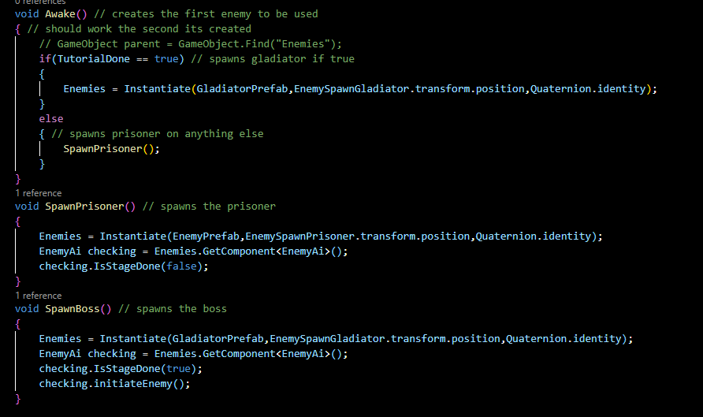
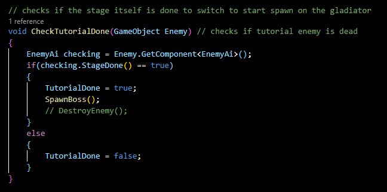
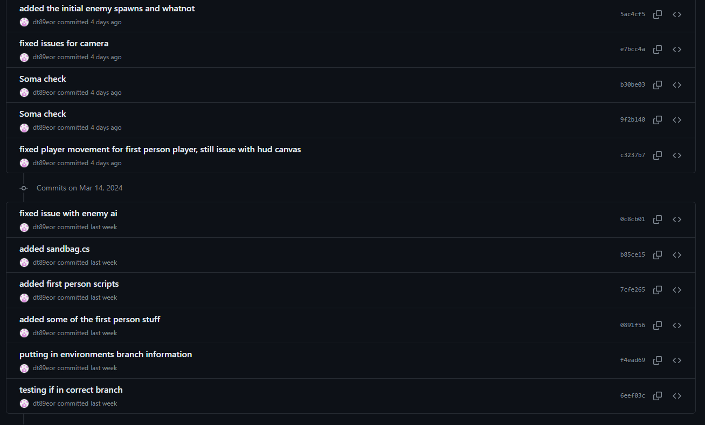

# Game Basic Information #

## Summary ##

## Gameplay Explanation ##

# Main Roles #

## Main Role 1 (Andrei) 

### Main Menu

### Credits Scene

### Death Menu

### End Screen

### In-game UI

### Camera Controller

### UI Resources

## Player (Soma) 

### Camera Movement

### Physics Materials

### Sword + Animations

### Physics Materials

### Resources Used

## Enemies (David)

### Assets Used
[Prisoner & Guard](https://assetstore.unity.com/packages/3d/characters/humanoids/fantasy/swordsman-170111)

[Gladiator](https://assetstore.unity.com/packages/3d/characters/humanoids/fantasy/crusader-tank-101601)

### Enemy Ai

### Enemy Factory (Spawner)
Like exercise 4, I used something like a Factory to instaniate the Prisoner and Gladiator as clones and then they were moved by the Scene Controller. 

There also was an update that checked when the Prisoner fight was done so that when needed it can immediatly start spawning in the Boss and have it ready for the Colloseum Scene. 

These would then be used in the SceneController to help move the Enemies to spots that Andre wanted them to be before the fights ever started.

### Enemy Colliders
For the Weapons, both the Gladiator and the Prisoner had a box collider on their respective weapon that they had equipped. The created box collider was a bit bigger than the actual texture so that when an attack was made, it would for sure be able to register if it was a hit or not. For the Gladiator, he had a shield that also has a box collider which can then be used

### Animation System (Enemy)

# Sub-Roles
Play Tester + Debugger / FineTuning [David](https://github.com/dt89eor)

Initial Merger [David](https://github.com/dt89eor)

### Play Tester + Debugger / FineTuning (David)
Became a debugger for the game as it was getting closer to the due date and was able to help fix issues that both Soma and Andrei had when looking over the code. Play tested after every push to find any issues with the current game and then fix issues or improve upon some aspects of the enemy animations. 

### Initial Merger (David)
Created the initial merge here by using the old main as the final product  

# Further Improvements + Fixes #

### Enemies
What would be nice is to have more than one enemy per fight and have the camera switch lock on between enemies. Another thing is to have a more robust movement and attacking system, where the enemy will constantly try to strafe left and right. They would also try to time the blocking to the player attacks so the enemy would not take any damage. In addition maybe adding more scripted fights to the story as there are 2 empty cells for at least 2 more fights in the dungeon portion before the gladiator fight. Included could be more animations for the enemies with a more varied attacks, block breaking and maybe even a jump attack. Then we could also change how fast the animations play based on how much health the enemy has, with lower health enemies attacking faster and doing more damage while blocking less. Then if we want to add more for the visuals, we could add in a trail to show if they are enraged and thus would do more damage to the player.

