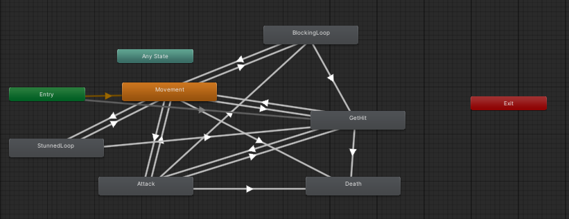

# Death Blow #

## Summary ##

You have been held prisoner in the dungeons underneath a coliseum. You have grown weak and frail, similar to your cellmate. You have been given an opportunity to escape. “Fight and slay your cellmate and we will give you the freedom you have dreamt of.”

Weave in and out of enemy attacks to gain the advantage in lethal combat. One hit and the fight may be lost.

## Project Resources

[Web-playable Game](https://wakamoli.itch.io/death-blow)  
[Trailor](https://youtu.be/gAFm3i8_IK8)  
[Press Kit](https://github.com/CLion2/ECS179_Project/blob/74fa19849f1579fd80a9ecba850ee66c9398d2dd/PressKit.md)  
[Proposal](https://docs.google.com/document/d/1zCoWcRq2JFVWmfBo8kEtM3IQDmox__Ku/edit?usp=sharing&ouid=107318688404861168600&rtpof=true&sd=true)  

## Gameplay Explanation ##

**In this section, explain how the game should be played. Treat this as a manual within a game. Explaining the button mappings and the most optimal gameplay strategy is encouraged.**

**Add it here if you did work that should be factored into your grade but does not fit easily into the proscribed roles! Please include links to resources and descriptions of game-related material that does not fit into roles here.**

Player movement is done using the typical **WASD** input conventions. The Camera, by default, locks onto the enemy you are currently facing but can be disabled using `Mouse3/MiddleMouseButton` or  `L`. This allows you to freely move the camera however you please.

Mouse 1 or J is used to make an attack
For dodging you use spacebar + WASD for it to work, bear in mind there is a limit to the amount of dodges one can do before recharge
U is heavy attack
Shift + Mouse 0 doesnt currently work for heavy attacks
I or Mouse 2 is block which doesnt currently work

Optimum strategy is to attack then stay out of damage range so that the enemy can't hit you. Included is the fact that the Boss has a hidden rage meter which will increase Damage and Decrease attack delay the lower his health becomes up to a point where he can just one hit you at full health. 

#### Expected Bugs
1. Gladiator may get stuck in the blocking animation if a corner case in the code is hit. 
2. Respawning does not reset the position of the player and enemy due to some restrictions with how position is updated.
3. Blocking animation may get flipped with the regular sword holding animation by accident.

# Main Roles #

## Producer - None

## User Interface - Andrei Bayani

The user interface is split into 2 parts, menus and the HUD. The menus are implemented using a CanvasGroups in [`SceneController`](https://github.com/CLion2/ECS179_Project/blob/da9bf05b46d2a9e8f6f1b3624d3317500885bc0d/Project%20179/Assets/Scripts/SceneController.cs). `ShowMenu()` would trigger each specific CanvasGroup to show or hide. These canvas groups had button elements which would trigger functions in [`MenuController`](https://github.com/CLion2/ECS179_Project/blob/91fa381098ca9ffcdf0b76181bb762269869d346/Project%20179/Assets/Scripts/MenuController.cs) to activate particular functions based on each button. The hud itself was implemented using bars which was updated in [`SceneController`](https://github.com/CLion2/ECS179_Project/blob/da9bf05b46d2a9e8f6f1b3624d3317500885bc0d/Project%20179/Assets/Scripts/SceneController.cs) as well as in [`PlayerMovement`](https://github.com/CLion2/ECS179_Project/blob/91fa381098ca9ffcdf0b76181bb762269869d346/Project%20179/Assets/Scripts/PlayerMovement.cs) using [`Bar`](https://github.com/CLion2/ECS179_Project/blob/91fa381098ca9ffcdf0b76181bb762269869d346/Project%20179/Assets/Scripts/Bar.cs) which is attached to each bar on screen.

## Movement/Physics and Input - Soma Matsumoto

The “new-main” branch in our GitHub repository contains everything I have implemented for the role, including its animations, sounds, and visual effects (sword trails). 
The “new-main” branch exists independently, so that our members and the grading team can check the progress easily. Here is a list of what the first person player can do:
* Player can move just like other first person games.
* Player can perform light attacks, heavy attack, and block.
I have created their animations myself rather than importing them from the asset store. The primary reason for that is because I wanted to be familiar with Unity Engine, learning how to create animations and use them. I also created sword trails using Particle System 
* Player can perform dodging, inspired by the game “bloodborne.”
This is based on Exercise 1 in this course (Command Pattern). In exercise 1 Stage 4, I implemented a quick dash feature to achieve a ninja-like quick movement. I leveraged the experience for the dodge feature. 
* Camera can manually move based on the mouse input.
* Camera can lock on a target.
When the camera locks on a target, the player can move relative to the target position. 
This is based on Exercise 2. I used the Slerp method for the camera to follow a target smoothly.

## Animation and Visuals - Soma Matsumoto & David West

For the Enemy:

[Prisoner & Guard](https://assetstore.unity.com/packages/3d/characters/humanoids/fantasy/swordsman-170111)

[Gladiator](https://assetstore.unity.com/packages/3d/characters/humanoids/fantasy/crusader-tank-101601)

[Basic Motions](https://assetstore.unity.com/packages/3d/animations/basic-motions-free-154271)

[RPG Animations](https://assetstore.unity.com/packages/3d/animations/free-32-rpg-animations-215058)

**Describe how your work intersects with game feel, graphic design, and world-building. Include your visual style guide if one exists.**

## Game Logic - David West

**Document the game states and game data you managed and the design patterns you used to complete your task.**
Game Logic is split into 2 different files, an Enemy Controller which spawns in enemies and an Enemy AI which is the logic for all the enemies.

### Enemy Ai
For the Ai movement and figuring out the Nav Mesh Agent + Nav Mesh Surface used this Vid as a reference: 
[Creating AI](https://www.youtube.com/watch?v=TpQbqRNCgM0)

Enemy Ai has the bulk of the code for everything that the Enemies need to do, but by doing so the file length is really long. It has conditions to check if they are in a cutscene and need to be controlled by the Nav Mesh, there is the [attacks](Examples/EnemyAttack.png) + [on trigger events for the attacks](Examples/EnemyTrigger.png), [a checker for when animations are done](Examples/EnemyAnimDone.png), even a checker for when the [enemy is dead](Examples/EnemyDead.png) so as to not continuously update that dead enemy with more information. 

Enemy Ai needs public functions in there that will be used in other portions of the game for instance the [EnemyTakeDamage](https://github.com/CLion2/ECS179_Project/blob/151f24ab83aa1fcd7fc8276ada47ad05dd362869/Project%20179/Assets/Scripts/EnemyAi.cs#L201) function which is used by the player movement when a player attack lands on them. Most of the other functions are used to either relay messages to the Enemy Controller or be used as checkers in other portions of the project. 

### Enemy Factory (Spawner)
Like exercise 4, I used something like a Factory to instaniate the Prisoner and Gladiator as clones and then they were moved by the Scene Controller. 

There also was an update that checked when the Prisoner fight was done so that when needed it can immediatly start spawning in the Boss and have it ready for the Colloseum Scene. 

These would then be used in the SceneController to help move the Enemies to spots that Andre wanted them to be before the fights ever started.

### Enemy Colliders
For the Weapons, both the Gladiator and the Prisoner had a box collider on their respective weapon that they had equipped. The created box collider was a bit bigger than the actual texture so that when an attack was made, it would for sure be able to register if it was a hit or not. For the Gladiator, he had a shield that also has a box collider which can then be used to try to block attacks but only for a short period of time. The final colliders were on the bodies as they would be used to figure out if the player attacks landed on the enemies or not.

Used this vid here as a reference for colliders: [vid](https://www.youtube.com/watch?v=TpQbqRNCgM0)

### Enemy Animation System
Unity premade Animations:

[Prisoner & Guard](https://assetstore.unity.com/packages/3d/characters/humanoids/fantasy/swordsman-170111)

[Gladiator](https://assetstore.unity.com/packages/3d/characters/humanoids/fantasy/crusader-tank-101601)

[Basic Motions](https://assetstore.unity.com/packages/3d/animations/basic-motions-free-154271)

[RPG Animations](https://assetstore.unity.com/packages/3d/animations/free-32-rpg-animations-215058)

These animations were used for the Prisoner, Guard and Gladiator units. In some cases, some of the animations needed to be changed so that it can work correctly with the Enemy structure. When it came to using the animator the Prisoner was a lot simplier to do than the Gladiator. Since Guard uses the same Ai as the Prisoner nothing needed to be changed for guard. 

When it came to Prisoner Animator, it was on the simplier end because all Prisoner needed to do was move, attack, block which was only for testing purposes, getting hit and the animation for its death. It never needed to exit because of the way that the spider was made and when it did hit the end of death animation, update would not longer be called in the Enemy Ai thus no animations needed to every be called again.

Gladiator Animator on the other hand was not as simple since I needed to include not only what Prisoner had, it needed to add in more attacks, a checker for combo and make sure get hit wouldnt stop animations when being started for attacks.

# Sub-Roles

## Audio - Andrei Bayani

All audio assets are either in the [VO](https://github.com/CLion2/ECS179_Project/tree/77ecf6053977d8a3277aea7aa620d13b9597629c/Project%20179/Assets/VO) folder or the [SFX](https://github.com/CLion2/ECS179_Project/tree/77ecf6053977d8a3277aea7aa620d13b9597629c/Project%20179/Assets/SFX) folder.

The audio controller was taken from Project 4 of ECS 179 and directly imported into the code in parts where we wanted sounds to play such as in line 92 of [EnemyAI](https://github.com/CLion2/ECS179_Project/blob/d312d72cd1d2a7d0e50ad6286dfc11e3272f9ed3/Project%20179/Assets/Scripts/EnemyAi.cs#L92).

All voice lines were recorded with the help of Professor Josh McCoy and Kyle Mitchell. 

Sound effects were taken from websites like mixkit

- [Mixkit License](https://mixkit.co/license/#sfxFree)
Sword Hit, Sword Block
- [Pixabay License](https://pixabay.com/service/terms/)

Background sounds: fireplace loop, water dripping, Jail door closing
Trailer Music: Hum, Tribal Drums, Dramatic reveal

There was no background music and only the player had sound effects while all of the enemies had voice lines instead. The environment sounds typically play on loop and sound playing was not tied to an animation playing.

## Gameplay Testing - David West

### Play Tester + Debugger / FineTuning (David)
When play testing the issues that I ran into were things like:
- game was playing in the title screen
- Prisoner blocked the player from moving in a cutscene
- guard never opend the door
- Enemies would fall through the map
- Enemies would stare at the sky or the ground
- player would target the sky
- sword animations were imported incorrectly
- hud didnt update

Became a debugger for the game as it was getting closer to the due date and was able to help fix issues that both Soma and Andrei had when looking over the code. Play tested after every push to find any issues with the current game and then fix issues or improve upon some aspects of the enemy animations. 

### Initial Merger (David)
Created the initial merge here by using the old main as the final product 
 

## Narrative Design - Andrei Bayani

The Narrative Design was implemented in a three steps, first the dialogue script and setting, then the environmental design, and finally, the cutscene script given by [`SceneController`](https://github.com/CLion2/ECS179_Project/blob/da9bf05b46d2a9e8f6f1b3624d3317500885bc0d/Project%20179/Assets/Scripts/SceneController.cs). 

The initial setting we came up with was done so to narratively integrate why the player is fighting each enemy one on one. In this case, it would be the guard of the prison rigging the fights to occur.

I wrote down a script I wanted to use for the cutscenes in game from which I related to flowchart in this [document](https://docs.google.com/document/d/18bO_qTMEEXWKuAilj4EK9DWfh_-3ZIXKkjZZTr6iH1Y/edit?usp=sharing).

The environments were place manually and grouped together for ease of adjustment.

Assets used came from unity asset store which are located in the [7th Side](https://github.com/CLion2/ECS179_Project/tree/31787ff947ee031f93dc1560f1a540b75560073c/Project%20179/Assets/7th%20Side) and [SandBrick](https://github.com/CLion2/ECS179_Project/tree/31787ff947ee031f93dc1560f1a540b75560073c/Project%20179/Assets/SandBrick1) folders.

Finally, there's the cutscene script from [`SceneController`](https://github.com/CLion2/ECS179_Project/blob/da9bf05b46d2a9e8f6f1b3624d3317500885bc0d/Project%20179/Assets/Scripts/SceneController.cs) which checks `SceneTransition` and `cutscene` bools to determine the timings and whether or not to revoke player controls using `ToggleControls()` the state of the scene is given by `sceneState` which determines which portion of each function to run in `Scene0Prison()`, `Scene1Coliseum` and `GameEnd()`.

## Press Kit and Trailer - Andrei Bayani

[Press Kit](https://github.com/CLion2/ECS179_Project/blob/d312d72cd1d2a7d0e50ad6286dfc11e3272f9ed3/PressKit.md)

[Trailer](https://www.youtube.com/watch?v=gAFm3i8_IK8)

The primary goal of the press kit and trailer were to demonstrate the different gameplay features in the game including the cutscenes, different player actions like blocking, moving, attacking, etc, enemies taking and dealing damage and finally, game overs. Additionally, they're meant to get the player hyped at the idea of beating the boss.

## Game Feel and Polish - Soma Matsumoto

I created animations and implemented the player and camera controllers myself rather than importing a first person controller asset from the asset store. The choice was right since I was able to implement the features, like the dodge feature, that are not implemented in assets available in the store, leading to a better game feel. Since the game feel of a first person game largely depends on the feel of the player and camera movements, I worked on the player and camera movements carefully. If I had more time, I would work on creating better animations to maximize the game feel.

# Further Improvements + Fixes #

### Enemies
What would be nice is to have more than one enemy per fight and have the camera switch lock on between enemies. Another thing is to have a more robust movement and attacking system, where the enemy will constantly try to strafe left and right. They would also try to time the blocking to the player attacks so the enemy would not take any damage. In addition maybe adding more scripted fights to the story as there are 2 empty cells for at least 2 more fights in the dungeon portion before the gladiator fight. Included could be more animations for the enemies with a more varied attacks, block breaking and maybe even a jump attack. Then we could also change how fast the animations play based on how much health the enemy has, with lower health enemies attacking faster and doing more damage while blocking less. Then if we want to add more for the visuals, we could add in a trail to show if they are enraged and thus would do more damage to the player.
